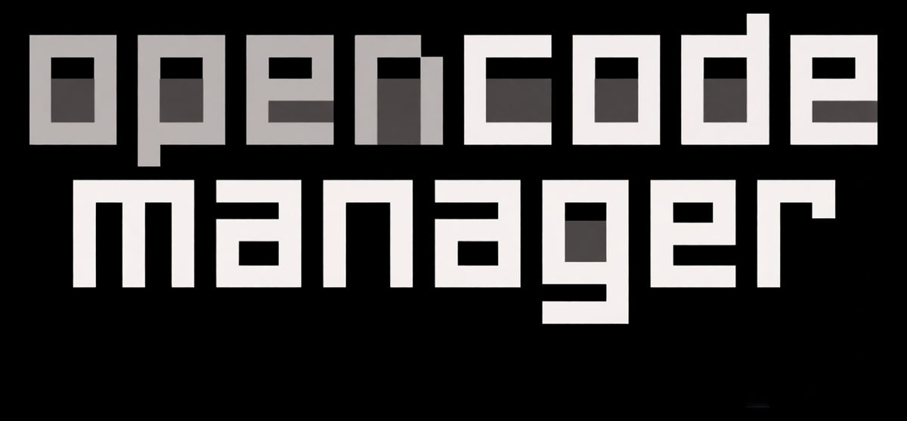

<p align="center">
    
</p>

<p align="center">
    <strong>Mobile-first web interface for <a href="https://opencode.ai">OpenCode</a> AI agents. Manage, control, and code from any device.</strong>
</p>

<p align="center">
    <a href="https://github.com/chriswritescode-dev/opencode-manager/blob/main/LICENSE">
        
    </a>
    <a href="https://github.com/chriswritescode-dev/opencode-manager/stargazers">
        
    </a>
    <a href="https://github.com/chriswritescode-dev/opencode-manager/releases/latest">
        
    </a>
    <a href="https://github.com/chriswritescode-dev/opencode-manager/pulls">
        
    </a>
</p>

<p align="center">
  
  
</p>

## Quick Start

```bash
git clone https://github.com/chriswritescode-dev/opencode-manager.git
cd opencode-manager
cp .env.example .env
docker-compose up -d
# Open http://localhost:5003
```

On first launch, you'll be prompted to create an admin account. That's it!

For local development setup, see the [Development Guide](https://chriswritescode-dev.github.io/opencode-manager/development/setup/).

## Screenshots

<table>
<tr>
<td align="center"><strong>Chat (Mobile)</strong><br/></td>
<td align="center"><strong>File Browser (Mobile)</strong><br/></td>
<td align="center"><strong>Inline Diff View</strong><br/></td>
</tr>
</table>

## Features

- **Git** — Multi-repo support, SSH authentication, worktrees, unified diffs with line numbers, PR creation
- **Files** — Directory browser with tree view, syntax highlighting, create/rename/delete, ZIP download
- **Chat** — Real-time streaming (SSE), slash commands, `@file` mentions, Plan/Build modes, Mermaid diagrams
- **Audio** — Text-to-speech (browser + OpenAI-compatible), speech-to-text (browser + OpenAI-compatible)
- **AI** — Model selection, provider config, OAuth for Anthropic/GitHub Copilot, custom agents with system prompts
- **MCP** — Local and remote MCP server support with pre-built templates
- **Memory** — Persistent project knowledge with semantic search, planning state, and compaction awareness
- **Mobile** — Responsive UI, PWA installable, iOS-optimized with proper keyboard handling and swipe navigation

## Configuration

```bash
# Required for production
AUTH_SECRET=your-secure-random-secret  # Generate with: openssl rand -base64 32

# Pre-configured admin (optional)
ADMIN_EMAIL=admin@example.com
ADMIN_PASSWORD=your-secure-password

# For LAN/remote access
AUTH_TRUSTED_ORIGINS=http://localhost:5003,https://yourl33tdomain.com
AUTH_SECURE_COOKIES=false  # Set to true when using HTTPS
```

For OAuth, Passkeys, Push Notifications (VAPID), and advanced configuration, see the [Configuration Guide](https://chriswritescode-dev.github.io/opencode-manager/configuration/environment/).

## Documentation

- [Getting Started](https://chriswritescode-dev.github.io/opencode-manager/getting-started/installation/) — Installation and first-run setup
- [Features](https://chriswritescode-dev.github.io/opencode-manager/features/overview/) — Deep dive on all features
- [Configuration](https://chriswritescode-dev.github.io/opencode-manager/configuration/environment/) — Environment variables and advanced setup
- [Troubleshooting](https://chriswritescode-dev.github.io/opencode-manager/troubleshooting/) — Common issues and solutions
- [Development](https://chriswritescode-dev.github.io/opencode-manager/development/setup/) — Contributing and local development

## License

MIT
